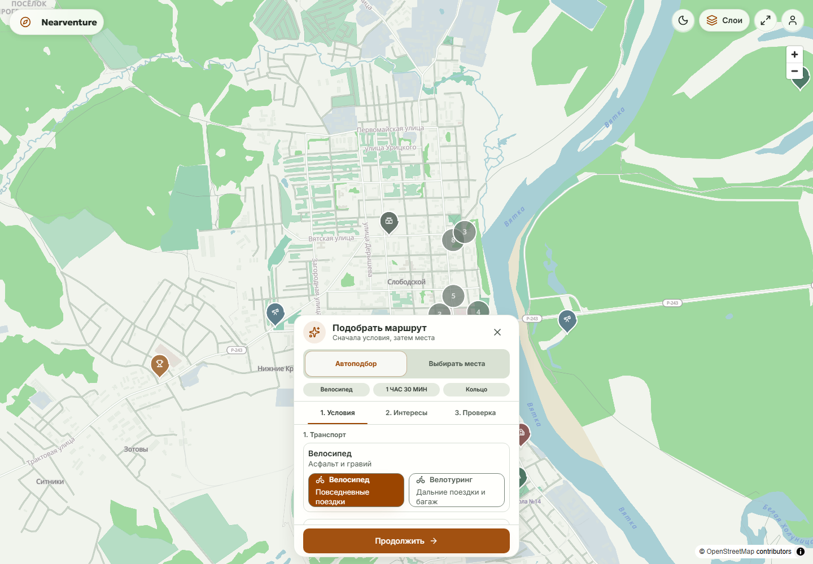

<div align="center">

# Nearventure

**Микро-приключения под рукой: маршрут на велосипеде или пешком — за N часов.**

Самохостящийся планировщик маршрутов к точкам интереса (POI). Выставь бюджет
времени — система покажет досягаемую зону (изохрону) и предложит POI с их
«стоимостью» (время/дистанция) — собери набор в корзину, как в магазине.
Авто-режим сгенерирует петлю по выбранным категориям; ручной — сам выбери
конкретные точки. Маршрут с высотами и GPX — одной кнопкой.

Охват — Приволжский федеральный округ (ПФО), с перспективой расширения.

<p>
  <a href="https://nearventure.ru"><strong>🌐 nearventure.ru</strong></a> ·
  <a href="https://t.me/nearventure_bot"><strong>🤖 @nearventure_bot</strong></a> ·
  <a href="https://t.me/nearventure_bot/nearapp"><strong>📱 Мини-апп в Telegram</strong></a>
</p>

<p>
  Автор и контакт: <a href="https://t.me/staniverse"><strong>✍️ @staniverse</strong></a>
</p>

---



</div>

---

<div align="center">

<!-- Badges -->
<a href="LICENSE"></a>


<br/>
<a href="https://github.com/stanleymarch/nearventure/stargazers"></a>
<a href="https://github.com/stanleymarch/nearventure/fork"></a>
<a href="https://github.com/stanleymarch/nearventure/commits"></a>

</div>

<br/>

## Идея

`Nearventure` — это сервис для микро-путешествий. Он помогает придумать маршрут
на велосипеде или пешком, когда есть несколько часов и желание увидеть что-то
новое, но нет идей, куда именно поехать.

Вы говорите системе, сколько у вас времени и на чём вы двигаетесь (велосипед /
пешком / авто), выбираете категории интересного — озёра, церкви, купеческое
наследие, парки, — и получаете предложение: POI с их «стоимостью» в минутах от
старта, как товары на витрине. Соберите подходящие в корзину — система построит
маршрут с учётом бюджета, проверит, что все точки влезают, и отдаст готовый GPX.

Два режима:
- **Авто-подбор** — выставь бюджет, выбери категории; система сама найдёт
  интересные POI, соберёт петлю и сгенерирует маршрут.
- **Ручной** — кликай по конкретным POI на карте, составляй свой набор; маршрут
  строится по твоим точкам в оптимальном порядке (TSP).

### Почему это важно

Ценность путешествия не всегда пропорциональна его дальности. Микро-путешествие —
то самое «near adventure» — работает иначе. Оно не требует подготовки, не выбивает
из ритма, но даёт свежие впечатления и чувство, что день прожит не зря. Особенно
это важно, если работаешь удалённо или есть час обеда, который можно потратить не
на скроллинг ленты, а на что-то живое. Nearventure делает хорошую идею доступной
одной кнопкой.

### Гражданская наука и открытые данные

Nearventure использует **только открытые данные**: OpenStreetMap, Wikidata,
Wikimedia, Wikivoyage и открытые данные Министерства культуры РФ. Это не только
прагматика (платные карты стоят денег, которых у маленького проекта нет), но и
принципиальная позиция.

Здесь есть более глубокая логика: открытые карты живут ровно настолько, насколько
в них вносят вклад. Каждый велосипедист, заметивший, что тропинка заросла или
указатель неправильный, может внести исправление, которое улучшит карту для всех.
Nearventure — это не только потребитель открытых данных, но и **канал, который
мотивирует людей в них вкладываться**: доехал до точки — сфотографируй, проверь,
существует ли объект, заполни недостающие теги в OSM. Это превращает велопрогулку
в акт гражданской науки.

> Архитектура и технические решения: **[docs/ARCHITECTURE.md](docs/ARCHITECTURE.md)**
> · План и статус: **[docs/ROADMAP.md](docs/ROADMAP.md)**

---

## ✅ Дорожная карта

> Полная версия с критериями приёмки — в **[docs/ROADMAP.md](docs/ROADMAP.md)**.
> Легенда: ✅ готово · 🚧 в работе · ⬜ запланировано.
### Бета 0.1
Бета прошла аудит `pfo-v0.1-v1` с **30 359 POI** и GraphHopper с семью профилями (`car`, `bike`, `bike_touring`, `mtb`, `mtb_leisure`, `foot`, `foot_scenic`); это техническая проверка конкретного состояния, а не обещание для следующего bundle или device acceptance.
Канонический [poi-toolkit](https://github.com/stanleymarch/poi-toolkit) готовит bundle; Nearventure только безопасно его импортирует.
Бета не заявляет полностью self-hosted карту: локальная PMTiles-подложка дополнена внешними картографическими assets.
Telegram device acceptance с replacement token и чистый публичный GitHub baseline после ротации секретов — незакрытые owner gates.
См. [чек-лист приёмки беты](docs/beta-acceptance-checklist.md).

### База (MVP)
- [x] Карта (MapLibre GL JS) с PMTiles-подложкой, изохроной и контролем слоёв
- [x] POI-слой из OSM/Wikidata/Wikivoyage/ЕГРКН (30 000+ объектов ПФО)
- [x] Роутинг через GraphHopper (точка-в-точку, round-trip, optimize/TSP)
- [x] Мульти-POI маршруты, кольцо, GPX-экспорт одной кнопкой
- [x] Telegram-бот: геолокация → карточки POI → маршрут → GPX
- [x] Telegram Mini App (`/tg/`): каталог и предпросмотр маршрутов
- [x] Аналитика, подписки и сохранённые маршруты
- [x] Метафора корзины: бюджет времени + POI как товары + живая бюджет-полоса
- [x] Два режима построения: авто-подбор (по категориям) и ручной (по точкам)
- [x] Изохрона досягаемости, TSP-оптимизация, enrichWithPois

### 🚧 Следующие цели
- [ ] **Насыщение описаний POI локальным Deep Research** — чтобы база стала
      достаточно «жирной» для AI-помощника (см. ниже), с качественными
      двуязычными описаниями, историей и контекстом по каждому объекту.
- [ ] **AI-помощник с WebXR VRM-аватаром** — кошко-девочка-проводник: помогает
      спланировать маршрут голосом/чатом, показывает объекты на карте, живёт в
      браузере и в Mini App. VRM-модель рендерится в WebXR.
- [ ] **Геймификация** — XP, бейджи, серии (streaks), уровни за вклад в открытые
      данные. Механика, которая делает сбор данных удовольствием, а не
      «собирательством значков».
- [ ] **Обучающие материалы по контрибьюту** — короткие гайды «как добавить
      точку в OSM», «как загрузить фото на Wikimedia Commons», «как проверить
      объект в полевых условиях». Прямо в боте и на сайте.
- [ ] **Сбор данных для Gaussian Splatting и звукового архива** — миссии:
      4K-облёт объекта для 3D-реконструкции, запись амбиент-звука, проверка
      состояния исчезающих мест. Медиа — во внешнее хранилище, не на VPS.
- [x] **PMTiles** — Protomaps `pfo.pmtiles` через MapLibre GL JS. ~1 ГБ вместо
      10–20 ГБ растра, без тайл-сервера (ADR-005).

### ⬜ Дальше
- [ ] «Магический» round-trip — генерация *действительно интересных* петель по
      бюджету времени (скоринг интересности, изохроны, обход грязи после дождя).
- [ ] MCP-сервер — Nearventure как инструменты для внешних AI-агентов.
- [ ] Чат-компаньон в браузере (Vercel AI SDK, BYO-key) — навигирует картой.
- [ ] i18n (ru/en) — двуязычные данные и интерфейс с самого начала.
- [ ] Цифровые следы региона → связка с проектом MetaVyatka (3D/звук/фото-архив).

---

## Стек и почему именно он

| Слой | Технология | Почему |
|:--|:--|:--|
| **Бэкенд** | NestJS (TypeORM, JWT, cron) | Модули, DI, cron-задачи ингеста. Логика пишется один раз и экспонируется через REST, MCP и Telegram-бота |
| **Фронтенд** | Vue 3 + Vite + Tailwind + MapLibre GL JS | WebGL-векторная карта с Protomaps + PMTiles. SSR тут ни к чему |
| **БД** | PostgreSQL + PostGIS + pgvector | Пространственные запросы и семантический поиск в **одной** базе. Не Supabase (8 ГБ, не влезает в 4 ГБ рядом с GraphHopper) |
| **Роутинг** | GraphHopper | Встроенные `round_trip`, `optimize` (TSP), высоты SRTM. OSRM не умеет высоты и round-trip |
| **Telegram** | grammY (в процессе NestJS) | Активно поддерживается, типизация, ≈0 доп. RAM. Телеграм как второй интерфейс с той же логикой |
| **Тайлы** | Локальные PMTiles + внешние map assets | Базовая подложка ПФО отдаётся nginx; glyph/sprite и часть raster/terrain-слоёв остаются внешними зависимостями беты |
| **POI-пайплайн** | Внешний **poi-toolkit** (TypeScript) | Сбор, дедупликация и экспорт POI. Nearventure только валидирует manifest и импортирует датасет |
| **Инфра** | Docker Compose (2 vCPU / 4 ГБ / 30 ГБ + swap) | Жёсткое ограничение VPS за 150 ₽ диктует все ресурсные решения |

> Подробное обоснование альтернатив (почему не Supabase / Mapbox / OSRM / React /
> Telegraf) — в [ADR-001…009](docs/architecture-future-and-adr.md#14-записи-архитектурных-решений-adr).

---

## POI-пайплайн

Канонический пайплайн сбора, дедупликации и экспорта POI — внешний
TypeScript-репозиторий **poi-toolkit**
(https://github.com/stanleymarch/poi-toolkit). Он владеет коллекцией,
качеством, provenance и выпускает **manifest-валидируемые bundle** (`SQL +
manifest.json`), которые Nearventure **импортирует** единственным разрешённым
путём — `apps/backend/src/importer` (прод: одноразовый Compose-сервис
`poi-importer`, профиль `import`; локально — `npm run import:poi`, atomic
staging swap с advisory-lock сериализацией). Подробнее: docs/data-refresh.md.

---

## Быстрый старт (разработка)

```bash
npm install

# 1. (один раз) скачать выгрузку OSM для выбранной территории для GraphHopper
bash scripts/download-osm.sh

# 2. поднять дата-сервисы (нужен Docker)
docker compose -f docker/docker-compose.yml up -d
#    первый старт graphhopper строит граф + тянет SRTM (~1–3 мин)

# 3. запустить бэкенд и фронтенд (с логированием)
npm run dev:backend:log    # → :3000, логи в logs/backend.log
npm run dev:frontend:log   # → :5173, логи в logs/frontend.log

# 4. (опционально) наполнить каталог POI — импорт bundle внешнего poi-toolkit:
#    скачайте v1-bundle из GitHub Releases poi-toolkit и следуйте docs/data-refresh.md
#    («Приём v1 bundle»). Без него карта и маршрутизация работают, но каталог пуст.
```

Остановить сервисы: `npm run kill:backend` / `npm run kill:frontend` (через PID-файлы).

> **Важно для агентов/автоматизации:** сервисы запускаются вручную (см.
> [AGENTS.md](AGENTS.md) / [CONTRIBUTING.md](CONTRIBUTING.md)). Не запускайте
> `dev:*` сами без явной просьбы.

### Переменные окружения

Скопируйте примеры и заполните секреты:

```bash
cp apps/backend/.env.example apps/backend/.env     # бэкенд (БД, JWT, токены)
cp apps/frontend/.env.example apps/frontend/.env   # фронтенд (базовый URL API)
cp docker/.env.prod.example docker/.env.prod       # прод (домен, TLS, прод-секреты)
```

Где что и зачем — подробно расписано в **[docs/environment.md](docs/environment.md)**.
Кратко: `DB_*` — подключение к Postgres/PostGIS; `JWT_SECRET` — подпись токенов
админ-панели; `TELEGRAM_BOT_TOKEN` — токен от @BotFather (бот + вебхук + мини-апп);
`GRAPHHOPPER_URL` — роутер. POI-датасет импортируется из bundle внешнего
poi-toolkit (см. [docs/data-refresh.md](docs/data-refresh.md)) — ключей ингеста в рантайме нет.

---

## Сборка и прод

```bash
npm run build            # фронтенд → dist, мини-апп → dist, бэкенд → dist
npm run start:prod       # NestJS раздаёт собранный фронтенд + API
```

Продакшен-стек (nginx + TLS + Let's Encrypt) через Docker Compose:

```bash
cp docker/.env.prod.example docker/.env.prod && edit   # домен, пароли, токены
docker compose --env-file docker/.env.prod -f docker/docker-compose.prod.yml up -d
bash scripts/deploy/init-letsencrypt.sh                 # первый сертификат TLS
```

Полный гайд по деплою (VPS, Docker, домен, вебхук Telegram, мини-апп на `/tg/`) —
в **[docs/deployment.md](docs/deployment.md)**.

### E2E (Playwright через Chrome CDP)

```bash
chrome --remote-debugging-port=9222   # сначала запустите Chrome с CDP
npm run test:e2e
```

E2E, которые создают, изменяют или удаляют данные, fail closed: `E2E_API_URL`
должен указывать ровно на loopback (`localhost`, `127.0.0.0/8`, `::1`), иначе
нужен явный `E2E_SAFE_MODE=1`. Сброс БД дополнительно требует одноразовый
`ALLOW_DB_RESET=1` и loopback `DB_HOST`; обычный E2E setup передаёт этот opt-in
только после проверки безопасной цели.

---

## 💛 Поддержать проект

Nearventure — некоммерческий open-source проект одного автора. Если он оказался
полезен или вы хотите помочь развитию открытых карт региона — любая поддержка
ценна:

- ⭐ **Поставьте звезду** репозиторию — это бесплатно и помогает другим найти проект.
- 🐛 **Сообщайте о проблемах** и предлагайте улучшения через [Issues](https://github.com/stanleymarch/nearventure/issues).
- 📝 **Вносите данные в OpenStreetMap** — это делает карту лучше для всех (включая Nearventure).
- 💸 **Финансово** — через внешние ссылки Boosty или CloudTips в Telegram-боте
  (`/help` → «Помочь проекту»). Nearventure не принимает Telegram Stars,
  криптовалюту или платежи внутри приложения.
- 🛠️ **Контрибьюте кодом** — см. [CONTRIBUTING.md](CONTRIBUTING.md). Хорошие
  первые задачи помечены `good first issue`.

---

## Документация

| Документ | О чём |
|:--|:--|
| [docs/ARCHITECTURE.md](docs/ARCHITECTURE.md) | Каноническая архитектура + записи решений (ADR) |
| [docs/ROADMAP.md](docs/ROADMAP.md) | Поэтапный план со статусом и критериями приёмки |
| [docs/deployment.md](docs/deployment.md) | Деплой на VPS: Docker, домен, TLS, вебхук, мини-апп |
| [docs/product-vision.md](docs/product-vision.md) | Видение продукта, сценарии, не-цели и ADRs |
| [docs/environment.md](docs/environment.md) | Все переменные окружения — где, что и зачем |
| [poi-toolkit](https://github.com/stanleymarch/poi-toolkit) | Канонический POI-пайплайн: сбор, дедупликация, экспорт (внешний) |
| [docs/data-refresh.md](docs/data-refresh.md) | Обновление геоданных: PBF, граф, тайлы, импорт POI |
| [docs/beta-acceptance-checklist.md](docs/beta-acceptance-checklist.md) | Проверяемая приёмка беты и незакрытые owner gates |
| [CONTRIBUTING.md](CONTRIBUTING.md) | Как контрибьютить |
| [ACKNOWLEDGMENTS.md](ACKNOWLEDGMENTS.md) | Источники данных, библиотеки, шрифты, лицензии |

---

## Лицензия

- **Исходный код** — [GNU AGPL-3.0](LICENSE). Сетевая клаузула (раздел 13): если
  вы запускаете модифицированный Nearventure как сервис — обязаны открыть код
  изменений и указать происхождение идеи.
- **POI-датасет** — поставляется не в этом репозитории: он выпускается как bundle
  внешнего [poi-toolkit](https://github.com/stanleymarch/poi-toolkit) (**ODbL**,
  производный от OpenStreetMap, с компонентами CC BY-SA 4.0 от Wikivoyage и CC0
  от Wikidata); Nearventure только импортирует его.
- Зависимости и шрифты сохраняют свои лицензии — см. [ACKNOWLEDGMENTS.md](ACKNOWLEDGMENTS.md).

---

<div align="center">

**Спасибо, что заглянули. Хорошей поездки. 🚲**

<br/>


</div>
