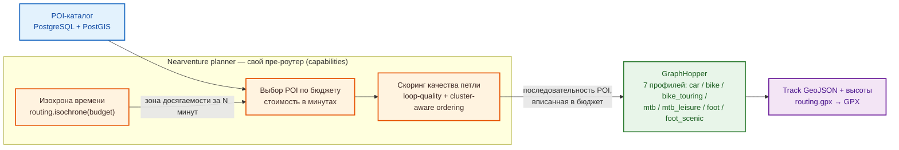

# Nearventure — Архитектура

> **Канонический источник истины.** Этот документ описывает целевую архитектуру
> Nearventure. Статус реализации — в [ROADMAP.md](./ROADMAP.md). Если код и этот
> документ расходятся, документ прав, пока код не починят (или документ намеренно
> не обновят).

---

## 1. Видение

**Nearventure** помогает эффективно потратить N часов: укажи время и чем
двигаешься — система покажет, куда можно успеть (изохрона), предложит POI с
их «стоимостью» (время/дистанция). Собери подходящие в корзину (аналог магазина
или авто-подбор по категориям) — получи маршрут с высотами и GPX одной кнопкой.
Серверная часть, POI-каталог и роутинг самохостятся на одном маленьком VPS.
В бете карта всё ещё использует внешние картографические assets (подробности —
[чек-лист беты](./beta-acceptance-checklist.md)); поэтому полный self-hosted
map stack не заявляется.

Охват production-графа — Приволжский федеральный округ (ПФО), с перспективой расширения.

### Четыре ключевых сценария

| # | Сценарий | Пример | Текущий статус |
|---|----------|--------|---------------|
| **A. Маршрут к цели** | Из точки к конкретному POI/категории, опционально кольцом. Возможно как авто-подбором, так и через ручной выбор точки. | «Доехать до озера и обратно» | ✅ |
| **B. Однодневный через несколько POI** | Ручной режим: выбери 2–5 POI на карте → TSP-оптимизация (кольцо или A→B). | «Объехать 3 усадьбы за день» | ✅ |
| **C. «У меня есть N часов»** | Бюджет времени → изохрона досягаемости → POI как «товары» с «ценой» в минутах. Режимы: авто-подбор (по категориям) или ручной набор (корзина). | «4 часа, велосипед, у воды» | ✅ |
| **D. Побочные квесты** | «Дай квесты рядом на N часов / в пределах M км» → маршрут со встроенными **миссиями** (снять 4K-облёт церкви для сплаттинга, записать звук, проверить исчезающее место, заполнить теги OSM). Геймифицировано. | Telegram: `/quest 2h 10km bike` | ⬜ |

Плюс необходимые вспомогательные поверхности: профиль высот, экспорт GPX
(обязательно для велоприложения), сохранённые маршруты, мультиязычный контент (ru/en).

### Высшая цель — воронка сбора данных гражданской науки

Поверх роутинга Nearventure — это **стимулируемая воронка сбора данных** для
выбранного региона: он ведёт людей к интересным или труднодоступным местам и
просит их задокументировать, возвращая данные в OpenStreetMap (Notes), Wikimedia
Commons и офлайн 3D-архивы (gaussian splatting). Геймификация (XP, бейджи, серии) —
это стимул, который делает сбор реальным.

---

## 2. Многослойная архитектура

```
┌─ БРАУЗЕР (Vue 3 + Vite + Tailwind + MapLibre GL JS) ───────────────────┐
│  MapStore (реактивные refs) — единый источник истины                    │
│    map, selectedPoi, currentRoute, poisLayer, elevation                 │
│    пишется кликами пользователя (ручной режим) И категориями (авто).   │
└────────────────────────────┬───────────────────────────────────────────┘
                             │ REST /api/*
┌────────────────────────────▼───────────────────────────────────────────┐
│  NestJS                                                                  │
│   ┌─ Capabilities (логика пишется ОДИН РАЗ) ──────────────────┐         │
│   │  pois.find / pois.semantic / pois.popular / pois.byId     │         │
│   │  routing.pointToPoint / routing.roundTrip / routing.plan  │         │
│   │  routing.isochrone / routing.gpx                          │         │
│   └──────┬──────────────────────┬─────────────────────────────┘         │
│   ┌──────▼──────┐    ┌──────────▼─────────┐                            │
│   │ REST /api/* │    │ Telegram-бот (grammY)│                            │
│   │ наш фронтенд│    │ тот же процесс:     │                            │
│   │ + миниапп   │    │ nearby, route, loop,│                            │
│   └─────────────┘    │ мини-апп /tg/       │                            │
│                      └─────────────────────┘                            │
│   ингест POI: manifest-валидируемый импортёр (bundle от poi-toolkit)  │
└──────────┬───────────────────────────┬──────────────────────────────────┘
           │                           │
   postgres + PostGIS + pgvector       graphhopper (PBF ПФО + SRTM)
```

**Планируемые поверхности (не реализованы):** MCP-сервер (Streamable HTTP) для
внешних AI-агентов; чат-компаньон (Vercel AI SDK, BYO-key) в браузере.
           │                           │
   postgres + PostGIS + pgvector       graphhopper (PBF ПФО + SRTM)
```

**Ключевая идея:** пишем доменную логику **один раз** в слое *capabilities*, затем
экспонируем через тонкие транспортные поверхности (REST для веба и миниаппа,
Telegram-бот зовёт сервисы напрямую in-process). Добавление новой поверхности
(MCP для внешних AI-агентов, чат-компаньон) — дёшево.

**Архитектурный принцип — выносим интеллект наружу (планируется).** Наш бэкенд
намеренно *«глупый» tools-сервер*. Интеллект (LLM agent-loop) будет жить **снаружи**
бэкенда: в браузере пользователя (BYO-key) для in-app компаньона или в собственном
агенте пользователя для пути MCP. Это держит бэкенд лёгким и избавляет от
оплаты/хостинга LLM. Пока не реализовано.

---

## 3. Технологический стек

| Слой | Выбор | Обоснование |
|------|-------|-------------|
| Бэкенд | **NestJS** | Модули, DI, cron (ингест), TypeORM. Гораздо лучше Next.js API-роутов для этого домена. |
| Фронтенд | **Vue 3 + Vite + Tailwind + shadcn-vue** | Интерактивная карта-SPA — его профиль. SSR ни к чему при WebGL-карте. |
| Карта | **MapLibre GL JS** + maplibre-contour + PMTiles (Protomaps) | WebGL-векторные тайлы: одна файла на весь ПФО, никаких тайл-серверов. |
| Тайлы | Локальный **PMTiles** (`pfo.pmtiles`) + внешние assets | Базовая подложка отдаётся nginx; glyph/sprite Protomaps и часть raster/terrain-слоёв — внешние зависимости беты. |
| БД | **PostgreSQL + PostGIS + pgvector** (один инстанс) | Гео-запросы + семантический поиск в одной БД. Без платформы Supabase, без отдельного векторного хранилища. |
| Роутинг | **GraphHopper** | Встроенный `round_trip` (сценарий C) + `optimize`/TSP (сценарий B) + `isochrone` + высоты SRTM. CH отключён для гибкого роутинга. |
| Telegram-бот | **grammY** в процессе NestJS | Геолокация → POI → маршрут → GPX. Активнее поддерживается и типобезопаснее Telegraf. |
| POI-пайплайн | **Внешний poi-toolkit** (TypeScript) + импортёр (NestJS) | Сбор и дедупликация — вне репо; Nearventure валидирует manifest и делает atomic import |
| Инфра | **Docker Compose** на VPS 2 vCPU / 4 ГБ / 30 ГБ + 4 ГБ swap | Жёсткое ограничение диктует все ресурсные решения. |

**Планируемые технологии (не реализованы):** MCP-сервер (`@modelcontextprotocol/sdk`, Streamable HTTP),
чат-компаньон (Vercel AI SDK core в браузере, BYO-key).

### Почему не…

- **Supabase (полная платформа):** ~10 контейнеров, минимум 8 ГБ. Не влезает в 4 ГБ
  рядом с GraphHopper. Берём только нужное — pgvector + свой JWT. См. ADR-003.
- **Mapbox:** не нужен. Используем векторные PMTiles + тему Protomaps. Высоты — SRTM.
- **Mastra:** построен *поверх* AI SDK, добавляет агент-бэкенд. Мы намеренно не хостим
  агента; интеллект внешний (будущее). См. ADR-004.
- **OSRM:** нет высот, нет `round_trip`, нет `isochrone` — критично для вело-приложения.
- **React/Next.js:** приложение — интерактивная карта-SPA, а не контент. SSR конфликтует
  с MapLibre (WebGL на сервере не имеет смысла). См. ADR-002.
- **Leaflet:** классический выбор для SPA-карт, но не поддерживает векторные тайлы
  Protomaps/PMTiles нативно. MapLibre GL JS даёт WebGL-производительность и
  программные темы (light/dark/contrast без смены URL тайлов). См. ADR-005.

---

## 4. Слой данных (PostgreSQL)

Один инстанс Postgres, три расширения (`CREATE EXTENSION postgis, vector, pg_trgm`)
через `docker/postgres/init-extensions.sql`.

### Сущности

**`poi`** (сердце проекта)
```
id, source (osm|wikivoyage|wikidata|egrkn), externalId, category, tags(jsonb),
geom geography(Point, 4326),
name_ru, name_en, name (fallback),
desc_ru, desc_en,
embedding vector(1536),          -- pgvector, генерируется при ингесте
imageUrl, featured bool, popularityScore float,
updatedAt
```
Пространство + семантика в одной строке: «ближайший POI со смыслом 'лесное озеро'
в пределах 10 км» = один SQL-join.

**`interaction`** (популярность без аккаунтов)
```
poiId, clientIdHash, type (view|like|route-add), createdAt
```
`clientId` = стабильный uuid в localStorage. `popularityScore` пересчитывается
периодически = взвешенное (просмотры + лайки + добавления в маршрут + богатство
контента + бонус featured). Rate-limit лайков на clientId.

**`route`** (сохранённые маршруты)
```
id, clientId, geojson, distance, duration, elevationGain, poiIds(jsonb), createdAt, title
```

**`user`** (из шаблона) — аккаунты админ/куратор + JWT. Для конечных пользователей не требуется.

### Пространственные запросы (PostGIS)
- POI в радиусе: `ST_DWithin(geom, $point, $radius)`
- POI в bbox, POI вдоль коридора маршрута, достижимость по изохроне — всё PostGIS.

### Семантический поиск (pgvector)
- Текст запроса → эмбеддинг → `ORDER BY embedding <=> $1 LIMIT k`.
- ~20 строк SQL, а не RAG-фреймворк (у нас короткие структурированные строки POI, а не 1000 PDF).

---

## 5. Слой capabilities

Доменная логика, написанная один раз. Каждая становится NestJS-сервисом,
экспонируемым всеми тремя транспортами.

| Capability | Назначение | Статус |
|------------|-----------|--------|
| `pois.find({bbox\|radius\|category})` | Гео-фильтр | ✅ |
| `pois.semantic({text, near, k})` | Поиск POI по смыслу (pgvector) | ✅ |
| `pois.popular({near})` | Трендовые POI | ✅ |
| `pois.byId({id})` | Детали + переводы | ✅ |
| `routing.pointToPoint({a,b,profile})` | Маршрут A→B | ✅ |
| `routing.roundTrip({start, budget, profile, seed})` | Петля по бюджету времени | ✅ |
| `routing.plan({waypoints, optimize, loop, enrichWithPois, enrichCategories})` | Сборный: сценарий A/B + обогащение POI | ✅ |
| `routing.isochrone({lat, lng, profile, time})` | Зона досягаемости за N минут | ✅ |
| `routing.gpx({geojson, pois})` | GPX-экспорт | ✅ |
| `geo.reverseGeocode({lat,lng})` | Определение названия места | 🕒 (частично) |
| `routes.save/load` | Сохранённые маршруты | ✅ |
| `missions.findNearby / generate / capture` | Квесты и захват медиа | ⬜ (Фаза 7) |
| `contributions.toOsmNote` | OSM Note | ⬜ |

---

## 6. Роутинг (GraphHopper) — три уровня «магии» для сценария C

Стек роутинга: POI-каталог (PostGIS) → собственный planner (пре-роутер Nearventure) →
GraphHopper → готовый трек/GPX.



Как работает бюджет времени: **бюджет (N минут)** → **изохрона** от старта с профилем
движения → **кандидаты-POI** внутри изохроны (с «стоимостью» в минутах) →
**последовательность POI**, вписанная в бюджет (loop-quality scoring + cluster-aware
ordering) → GraphHopper строит трек по точкам с высотами → GPX.

1. **Нативный round_trip.** GraphHopper `round_trip` с `distance`=бюджет.
   Генерируем варианты (`heading`/seed), скорим по интересности.
2. **POI-TSP (сценарий B).** GraphHopper `optimize` с `end_at_start=true`. Режим
   «ручной» в UI: пользователь собирает POI в корзину, система строит TSP-петлю.
3. **Isochrone + enrichWithPois.** Строим изохрону на `N` минут, находим POI внутри,
   оцениваем отклонения. При авто-подборе система предлагает POI рядом с маршрутом
   (`enrichWithPois=true`) с категорийным фильтром и буфером в метрах.
4. **Итеративно — гибрид (настоящая магия).** Изохрона + кластеризация POI + выбор
   подмножества так, чтобы TSP-петля влезла в бюджет и максимизировала интересность.
   R&D-фаза после работы A-C.

Оценка интересности = взвешенное (категория POI, рейтинг, разнообразие, набор высоты
для тренировок). Здесь Nearventure дифференцируется.

Для production зафиксировано датированное наблюдение оператора (2026-08-1x):
GraphHopper `11.0` сообщил `car`, `bike`, `bike_touring`, `mtb`, `mtb_leisure`,
`foot`, `foot_scenic`, и route smoke каждого профиля прошёл. Высоты SRTM; CH
используется только для `car`, остальные профили работают с LM для гибких
`round_trip` / `heading` / `alternative_route`. Наблюдение не отменяет health
перед следующей операционной процедурой.

---

## 7. Пайплайн ингеста POI

Сбор, дедупликация и экспорт POI-датасета выполняются **внешним**
TypeScript-пайплайном [poi-toolkit](https://github.com/stanleymarch/poi-toolkit)
(commit `9ca756b` и новее выпускают v1-манифест). Nearventure **не собирает** POI
сам: бэкенд содержит только **manifest-валидируемый импортёр**
(`apps/backend/src/importer/`, C6), который:

1. проверяет bundle против строгой zod-схемы v1-манифеста (SHA-256 артефактов,
   provenance, счётчики категорий);
2. читает артефакты безопасно (trusted root + dirfd-цепочки, fail-closed на
   не-Linux) — никакого pathname-резолвинга после заякорения;
3. выполняет atomic staging swap в одной транзакции с общим advisory-lock
   (`nearventure_poi_import_v1`) и пишет в audit-таблицу `poi_import_audit`.

Датированное наблюдение оператора (2026-08-1x)
зафиксировало production-аудит bundle `pfo-v0.1-v1`: 30 359 POI, tuple audit и
категорийные counts. Это снимок конкретного импорта, а не постоянное ожидаемое
число для будущих bundle.

Запуск в проде — одноразовый Compose-сервис `poi-importer` (профиль `import`,
read-only trusted-root mount): `docker compose --profile import run --rm poi-importer

---

## Продолжение

Планируемые возможности, записи архитектурных решений и открытые вопросы вынесены в [architecture-future-and-adr.md](./architecture-future-and-adr.md).
