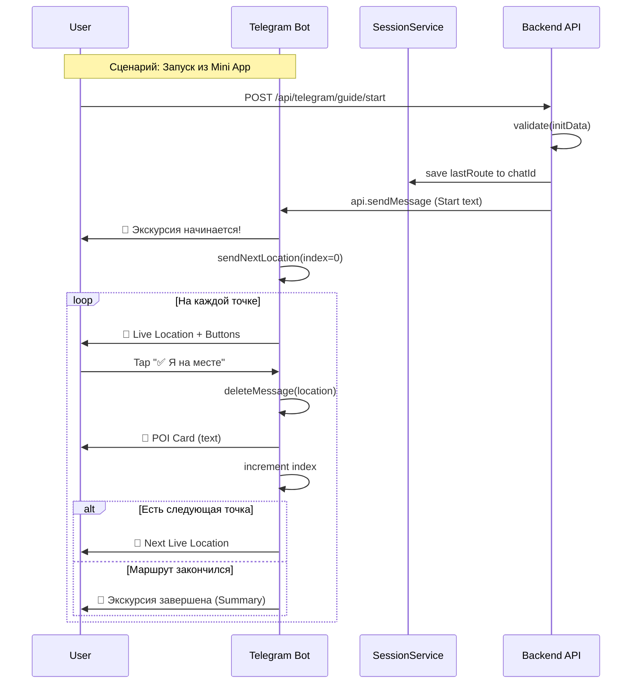

# Guide FSM — Экскурсовод в Telegram

## Обзор

Guide FSM (Finite State Machine) — это конечный автомат, управляющий процессом пошаговой экскурсии по маршруту в Telegram-боте. Пользователь получает последовательные точки маршрута (POI) с живыми локациями и интерактивными кнопками для управления прогрессом.

## Архитектура

### 1. Состояния (States)

Экскурсовод имеет два основных состояния, хранящихся в `SessionService`:

| Состояние | Описание | Данные в сессии |
|-----------|----------|-----------------|
| `GUIDE_WALKING` | Экскурсия идёт. Бот отправляет точки и ждёт реакции пользователя. | `lastRoute` (объект маршрута), `guideIndex` (текущая точка), `guideMessageId` (ID сообщения с локацией) |
| `GUIDE_DONE` | Экскурсия завершена. Пользователь видит сводку и предложения. | Финальные статы, очистка временных данных |

### 2. Точки входа (Entry Points)

Существует два способа запустить экскурсию:

#### A. Из Telegram-бота (авто-результат)
1. Пользователь строит маршрут через визард (`/start` -> «Маршрут за минуту»).
2. Бот возвращает результат с кнопкой **«▶ Проведи меня»** (`callback_data: route:guide`).
3. Обработчик `route:guide` берёт `lastRoute` из сессии и запускает `startGuide`.

#### B. Из Mini App (предпросмотр маршрута)
1. Пользователь собирает маршрут в Mini App и открывает экран превью (`RoutePreviewView`).
2. Нажимает кнопку **«Проведи меня»**.
3. Клиент (`useRouting.ts`) вызывает `POST /api/telegram/guide/start` с телом `{ initData, route }`.
4. Бэкенд валидирует `initData`, сохраняет `route` в сессию соответствующего `chatId` и отправляет проактивное сообщение в бот, запуская экскурсию.

## Детальный поток (Flow)



## Техническая реализация

### Валидация initData (Auth)

Для запуска из Mini App используется `TelegramAuthService`. Это гарантирует, что запрос на старт экскурсии исходит от реального пользователя в Telegram, а не от подделанного клиента.

**Логика (`apps/backend/src/telegram/telegram-auth.service.ts`):**
1. Парсинг `initData` (query string).
2. Проверка наличия `hash`.
3. Формирование `data_check_string`: сортировка параметров (кроме `hash`) и конкатенация `key=value\n`.
4. Генерация `secret_key` = HMAC-SHA256("WebAppData", `BOT_TOKEN`).
5. Сравнение HMAC-SHA256(`secret_key`, `data_check_string`) с полученным `hash`.
6. Извлечение `chatId` из поля `user.id`.

### Обработчики (Handlers)

Код находится в `apps/backend/src/telegram/guide.handler.ts`.

#### `startGuide(ctx, s, sessions)`
- Устанавливает `s.step = 'GUIDE_WALKING'`.
- Сбрасывает `guideIndex = 0`.
- Отправляет приветственное сообщение.
- Вызывает `sendNextLocation`.

#### `sendNextLocation(ctx, s, sessions)`
- Берёт POI по индексу `s.lastRoute.pois[s.guideIndex]`.
- Отправляет `ctx.replyWithLocation(lat, lon, { live_period: 900 })`.
  - `live_period: 900` (15 минут) — локация обновляется на карте клиента и исчезает по истечении времени или при движении пользователя.
- Прикрепляет inline-клавиатуру:
  - ✅ **Я на месте** (`guide:at:{index}`)
  - ⏭ **Пропустить** (`guide:skip:{index}`)
  - 🛑 **Завершить** (`guide:stop`)
- Сохраняет `message_id` отправленной локации в `s.guideMessageId` (чтобы потом удалить её).

#### `handleAtPoint(ctx, s, sessions)`
- Вызывается по `guide:at:{index}`.
- Удаляет сообщение с предыдущей локацией (`ctx.api.deleteMessage`).
- Отправляет текстовую карточку POI (имя, категория, ссылка на OSM).
- Инкрементирует `guideIndex`.
- Если `index < total`: вызывает `sendNextLocation`.
- Иначе: вызывает `endGuide`.

#### `handleSkip(ctx, s, sessions)`
- Аналогично `handleAtPoint`, но не отправляет карточку POI.
- Отправляет сообщение «⏭ Пропустили: ...».

#### `endGuide(ctx, s, sessions)`
- Устанавливает `s.step = 'GUIDE_DONE'`.
- Отправляет финальное сообщение со статистикой (точки, дистанция, время).
- Предлагает действия:
  - ⬇ **Скачать GPX** (`route:gpx`)
  - 🌱 **Помочь проекту** (`route:contribute`)
  - 🔙 **В меню** (`nav:home`)

## API Reference

### POST `/api/telegram/guide/start`

Запускает экскурсию из Mini App.

**Request Body:**
```typescript
{
  initData: string; // window.Telegram.WebApp.initData
  route: {
    geojson: object;
    distance: number;
    duration: number;
    pois: Array<{ id: string; name: string; lat: number; lon: number; category: string }>;
  };
}
```

**Response:**
```typescript
{ ok: true }
```

**Errors:**
- `401 Unauthorized`: Невалидный `initData`.
- `400 Bad Request`: Бот не инициализирован.

### POST `/api/routing/gpx`

Генерирует GPX файл для маршрута (используется в конце экскурсии).

**Request Body:**
```typescript
{
  route: {
    geojson: object; // GeoJSON LineString
  },
  name?: string;
}
```

**Response:**
- `Content-Type: application/gpx+xml`
- Binary GPX 1.1 file content.

## UI Компоненты

### Главная кнопка меню (MenuButton)
Настроена в `apps/backend/src/telegram/telegram.module.ts` через `bot.api.setChatMenuButton`.
- Текст: «🗺 Открыть карту»
- Тип: `web_app`
- URL: `miniAppUrl`

Кнопка отображается постоянно в интерфейсе бота (между иконкой профиля и полем ввода) и служит быстрым лончером Mini App.

### Inline-клавиатуры

Все клавиатуры генерируются через `apps/backend/src/telegram/keyboards.ts` (функция `keyboard`), поддерживая стилизацию кнопок (primary, danger, success).

## Ограничения и заметки

1. **Live Period:** Таймаут 15 минут (`900s`) выбран как баланс между удобством и устареванием данных. Если пользователь долгое время не нажимает кнопку, локация пропадёт, но FSM продолжит работать по кнопке «Я на месте».
2. **Валидация состояний:** Хэндлеры проверяют `s.step === 'GUIDE_WALKING'` и соответствие индекса `s.guideIndex`, чтобы избежать конфликтов при повторных нажатиях.
3. **Удаление сообщений:** Бот активно удаляет сообщения с локациями, чтобы не захламлять чат старыми пинами.
